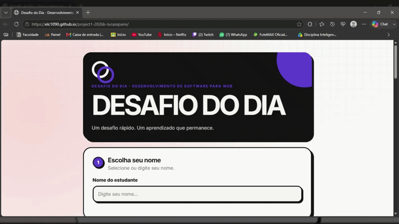

# Projeto: Remake de aplicação web simples



## Acesso
- Deploy: https://elc1090.github.io/project1-2026b-lucasxpaire/

## Desenvolvedor(a)
- Nome: Lucas Xavier Pairé
- Curso: Ciência da Computação

## App original

### Links
- Acesso: Nenhuma URL pública
- Repositório: https://github.com/elc1090/demo-challenge-of-the-day

### Descrição

O app original é um site para testar conhecimentos dos alunos através de testes, onde é feita uma pergunta e o aluno deve marcar uma opção de resposta e justificá-la.

O código possui uma arquitetura apenas de frontend com as tecnologias HTML, CSS e JavaScript. O frontend consome dados de um backend hospedado no Google Apps Script, que utiliza uma planilha do Google Sheets como banco de dados.

Os códigos apresentam uma estruturação clean code, como o uso de responsabilidade única, onde um método possui apenas uma responsabilidade. O uso das classe CSS são bem reutilizáveis, o que evita código duplicado e desnecessário.

## Demanda do(a) cliente

### Cliente
Giovana Borelli

### Demanda
- Histórico de questões: mostra todos os desafios anteriores. Pode ser em geral ou após escolher o nome do estudantes. Para o segundo caso, seria interessante mostrar histórico de acerto/erro se possível.
- Estética: no cabeçalho do site, ao lado do título e subtítulo, parece que muito espaço fica em branco.

## Desenvolvimento

### Processo

Primeiramente meu objetivo era reescrever todo o projeto do zero para ter controle sobre a base de código e os estilos. Cheguei a criar arquivos do zero para `index.html`, `style.css`, `app.js`. Porém, a complexidade do CSS original, a quantidade de códigos do `app.js` e reler a proposta do trabalho, percebi que a decisão mais inteligente seria compreender os códigos já existentes do projeto original e adicionar as novas alterações no projeto.

Para a demanda 1 sobre o histórico, eu li os códigos do `app.js` para saber como o frontend obtinha os dados dos alunos e dos desafios. Então vi que dentro do código `Code.gs` que é a API que o frontend consome, descobri que não existia lógica para devolver o histórico dos desafios e das respostas dos alunos.
Então eu criei:
- Duas novas rotas na API chamadas `getGeneralHistory` e `getStudentHistory`.
- Dentro de `app.js` criei o método `getHistory` para consumir a API e obter o histórico dos desafios ou o histórico das respostas dos desafios feitos pelo aluno. Esse método tem essas duas opções de retorno, pois apenas fiz uma verificação que se a identificação do estudante passada pelo parâmetro for nulo, então o método está sendo chamado para obter o histórico geral de todas os desafios feitos, senão está sendo chamado para obter o histórico de respostas dos desafios do estudante.
- Criei uma nova `<section>` para o histórico de desafios no fim da página do `index.html`, fazendo com que a funcionalidade seja acessível após o fluxo obrigatório do aluno ter sido feito primeiramente, que no caso é responder a pergunta do desafio.
- Implementei uma regra de negócio para utilizar esse histórico de desafios:
  - Histórico geral: Ao clicar no botão `Ver todos os desafios`, mostra todas os desafios feitos anteriormente e a data da criação deles.
  - Histórico do estudante: É necessário selecionar o estudante na etapa 1 do fluxo de identificação do estudante para responder o desafio. Dessa maneira, o estudante responde o desafio e no fim da tela vai visualizar automaticamente todos os seus desafios anteriores, fazendo com que ele não precise digitar seu nome novamente para buscar o seu histórico.

Para a demanda 2 sobre a estética do cabeçalho, eu li as regras CSS aplicadas a tag `<h1>`. Descobri que o espaço em branco ocorria devido a propriedade `max-width: 8ch`, isso forçava o título a ter a largura de 8 letras no máximo, porém o texto tinha um total de 14 letras: `Desafio do dia`. Por isso, o texto não cabia e o comportamento do navegador quebrava o resto do texto para a próxima linha.
A correção foi adicionar a regra `white-space: nowrap`, que diz para não quebrar o texto de jeito nenhum.

### Trechos de código

**1. Ajuste no CSS**:

Esse ajuste mostra que nem sempre é necessário uma solução mirabolante ou muito detalhada que precisasse refatorar todo o layout, pois apenas uma propriedade `white-space: nowrap` serviu como uma solução que resolvia a causa.

```css
h1 {
  position: relative;
  z-index: 1;
  font-size: clamp(3rem, 17vw, 5.8rem);
  white-space: nowrap; 
}
```

**2. Rotas limpas**:

Essa adição mostra as rotas criadas na API, aplicando um critério clean code chamado Princípio de Responsabilidade Única. Fazendo com que a api retorne exatamente o necessário, dividindo a chamada de histórico em duas funções (geral e por aluno). 

```javascript
case 'getGeneralHistory':
  return jsonResponse_({ success: true, history: getGeneralHistory_() });
case 'getStudentHistory':
  return jsonResponse_({ success: true, history: getStudentHistory_(e.parameter.student_id) });
```

**3. Lógica condicional e renderização dinâmica**:

Essa função `getHistory()` busca os dados da API e utiliza uma lógica condicional para decidir quais elementos html usar para montar a interface somente necessária (histórico do estudante ou histórico de desafios).

```javascript
async function getHistory(studentId = null) {
  let url = getApiUrl(studentId ? "getStudentHistory" : "getGeneralHistory");
  if (studentId) {
    url += `&student_id=${encodeURIComponent(studentId)}`;
  }
  
  // ... 
    
  if (studentId) {
    renderStudentHistory(data.history);
    historyTitle.textContent = "Seu Histórico";
    historySubtitle.textContent = "Veja o seu desempenho nos desafios passados.";
  } else {
    renderGeneralHistory(data.history);
    historyTitle.textContent = "Histórico de Desafios";
    historySubtitle.textContent = "Veja todos os desafios lançados até hoje.";
  }
}
```

## Tecnologias

### Linguagens e afins
- HTML
- CSS
- JavaScript
- Google Apps Script

### Ambiente de desenvolvimento
- Vscode
- Git e Github
- Python HTTP Server
- Google Sheets

## Referências e créditos
- Documentação da MDN: https://developer.mozilla.org/pt-BR/
- Utilização de Gemini para insights de UI/UX design para melhor experiência do usuário.

---
Projeto entregue para a disciplina de [Desenvolvimento de Software para a Web](http://github.com/andreainfufsm/elc1090-2026b) em 2026b